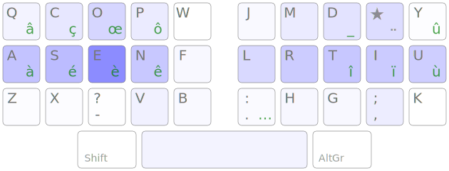
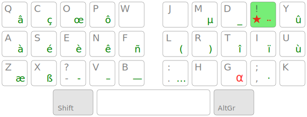
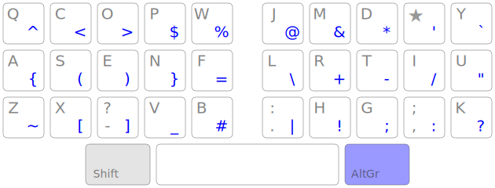

[Ergo‑L](https://ergol.org/)
================================================================================

[**(in English hereinafter)**](#English)

Une disposition de clavier ergonomique optimisée pour le français, l’anglais et
le code.

- Disposition **optimisée pour le français _et_ l’anglais**;
- Couche AltGr optionnelle, optimisée pour l’enchaînement des symboles de
  programmation;
- **Conservation des raccourcis usuels** : <kbd>Ctrl-{Q,A,S,Z,X,V}</kbd>
  (<kbd>Ctrl-C</kbd> est décalé, mais reste faisable d’une main);
- Support de tous les caractères spéciaux utilisés en français (diacritiques,
  majuscules accentuées, lettres entrelacées, symboles de ponctuation…);
- **Chiffres en accès direct**.


English
--------------------------------------------------------------------------------

A Colemak-style layout for French-speaking users.


TL;DR:
--------------------------------------------------------------------------------

* a Colemak-style keyboard layout optimized for French and English;
* most common keyboard shortcuts are preserved (like in Colemak);
* use a dead key for the most frequent accented characters;
* use the AltGr layer for programming symbols.

This layout claims to be better than Bépo for French, better than Dvorak for
English and better than Qwerty for programming. [Check the stats !][1]

[1]: https://ergol.org/stats/#/ergol/iso/en+fr


Layout
--------------------------------------------------------------------------------



The dead <kbd>★</kbd> key gives access to all acute accents, grave accents,
cedillas, digraphs and quote signs you’ll need to write in proper French:



… and the AltGr layer is fully dedicated to programming symbols.



The default layout allows to write in English, French, German and Esperanto
easily.

[More information on the website](https://ergol.org) (in French).


Availability
--------------------------------------------------------------------------------

Kalamine is available on Debian Unstable. It is automatically installed
via the `xkb-data` package.

Install
--------------------------------------------------------------------------------

You’ll need the latest version of [Kalamine][2] to build your own layout. We
*highly* recommend using [pipx][5], once you have it installed (by following
their guide), you can just run the following command:

```bash
pipx install kalamine
```

Download the [layouts/ergol.toml][4] file in this repo and build the layout :

```bash
kalamine build ergol.toml
```

You’ll get a `dist` folder containing all the drivers.

Then, to install Ergo‑L, follow the [install section of Kalamine’s repo][3],
and you should be good to go !

[2]: https://github.com/OneDeadKey/kalamine
[3]: https://github.com/OneDeadKey/kalamine#installing-distributable-layouts
[4]: https://github.com/Nuclear-Squid/ergol/blob/master/layouts/ergol.toml
[5]: https://github.com/pypa/pipx?tab=readme-ov-file#install-pipx


### Install (Linux only)

`xkalamine` is a linux‑specific tool (shipped with `kalamine`) to easily
install keyboard layouts on Linux. You can drop `sudo` if you use wayland, but
it’s required on Xorg.

```bash
sudo xkalamine install ergol.toml  # Install the layout
```

Then switch to Ergo‑L using the following command:

```bash
setxkbmap fr -variant ergol  # Switch your keyboard layout to ergol
```

_Troubleshooting with ubuntu / wayland_

There is a weird issue where Ergo-L works fine with some applications
(phpstorm, gnome,...) but not on others (libreoffice, terminator). The deadkey
remain for two chars instead of only one. (ex: `a[deadkey]sen` should display
`aéen` but it displays `aéèn` instead.).

This issue is solved by adding at the end of `/etc/environment` the following lines:

```bash
INPUT_METHOD=ibus
GTK_IM_MODULE=ibus
QT_IM_MODULE=ibus
XMODIFIERS=@im=ibus
```

Make Your Own !
--------------------------------------------------------------------------------

If you wish to modify the layout, the `layouts/*.{toml,yaml}` are human-readable
ASCII arts of the final layout. You can easily edit them, then run `make` (or
`make watch`) at the root of the repo to generate the `.json` files used to
benchmark layouts on the [stats page][1].

This repo contains all of the code for the [Ergo‑L website](https://ergol.org),
so you can run the page locally to try your prototypes !

### Edit Corpora

The different corpora can be found in [`corpus/`](corpus/), mainly `fr.txt` and
`en.txt` which can be edited to change the type of text used (for instance if
you don’t write like translators of Miguel de Cervantes, or if you want to test
with your own emails).

If you have multiple source files, you can thus merge them using the
[`merge.py`](corpus/merge.py) script, for instance:

```bash
python3 merge.py file-fr‑1.txt … file-fr-n.txt > fr.txt
```

Once this is done, the statistics file can be generated using the
[`chardict.py`](corpus/chardict.py) script. Note that for this step, you don’t
want to have parasitic `.txt` files in the `corpus` directory, or their stats
will be generated as well.

```bash
python3 chardict.py
```

For the sake of completeness, we add that specifying a **single file** after the
command generates the `json` stat file for this specific corpus.

### Run a Local Server

[Hugo](https://gohugo.io/) can be used to serve the site, it automatically
watches and live-reload the pages upon file changes, however you still need to
have `make watch` running to ensure that the `.json` files are generated upon
modifying human-friendly layouts in `layouts/*.{to,ya}ml`.

You can thus run your local instance of the Ergo‑L website either by running
`hugo server` in the [`www/`](www/) directory, or _via_:
```
hugo server --source www/
```

By default, the server will run on port `1313`: http://localhost:1313/

The stats page is now accessible on
<http://localhost:1313/stats/#/ergol/ol60/fr>!

**Note:** This solution supports live-reload for most parts. While it’s not a
problem while editing the content, some stats are not fully refreshed with
live-reload. You may have to manually refresh the stats page after editing a
layout or a corpus to have the correct version of them.
