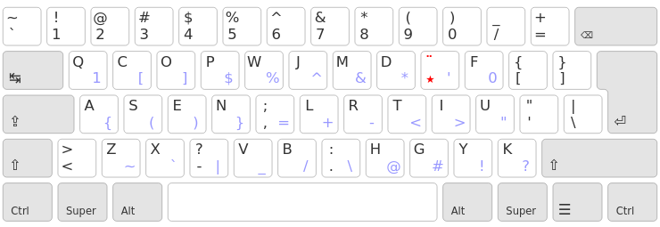
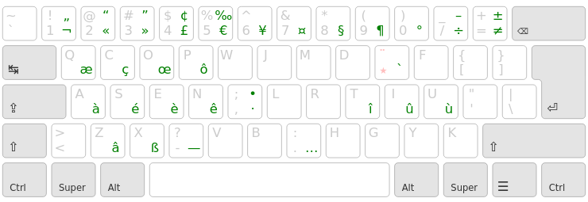
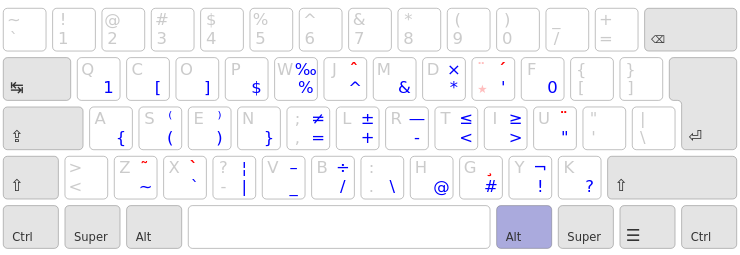

Ergo-L
================================================================================

A Colemak-style layout for French-speaking users.


TL;DR:
--------------------------------------------------------------------------------

* a Colemak-style keyboard layout optimized for French and English;
* most common keyboard shortcuts are preserved (like in Colemak);
* use a dead key for the most frequent accented characters;
* use the AltGr layer for programming symbols. Or don’t use it at all, and keep two alt keys.

This layout claims to be better than Bépo for French, better than Dvorak for
English and better than Qwerty for programming. (see
[here](https://ergol.org/stats#/ergol/iso/en+fr) to get the stats)


Layout
--------------------------------------------------------------------------------



The dead <kbd>★</kbd> key gives access to all acute accents, grave accents, cedillas, digraphs and quote signs you’ll need to write in proper French:



… which leaves the AltGr layer fully available for any customization you have in mind.



The default layout allows to write in English, French, German and Esperanto easily.

[More information on the website](https://ergol.org) (in French).


Install
--------------------------------------------------------------------------------

You’ll need the latest version of [Kalamine](https://github.com/fabi1cazenave/kalamine) to build your own layout:

```bash
sudo -s  # Yes, you *do* need root privileges
pip install kalamine
```

Download the `layouts/ergol.yaml` file in this repo and build the layout :

```bash
kalamine ergol.yaml
```

You’ll get a `dist` folder containing all of the drivers.

Then, to install ergol, follow the [install section of Kalamine’s repo](https://github.com/fabi1cazenave/kalamine#install), and you should be good to go !

Make your own
--------------------------------------------------------------------------------

If you wish to modify the layout, the `layouts/*.yaml` are human-readable ascii
arts of the final layout. You can easily edit them, then run `make` (or `make
watch`) at the root of the repo to generate the `.json` files used to benchmark
layouts on the [stats page](https://ergol.org/stats#/ergol/iso/en+fr).

This repo contains all of the code for the [ergol website](https://ergol.org),
so you can run the page locally to try your prototypes !
