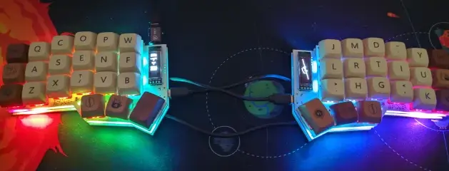
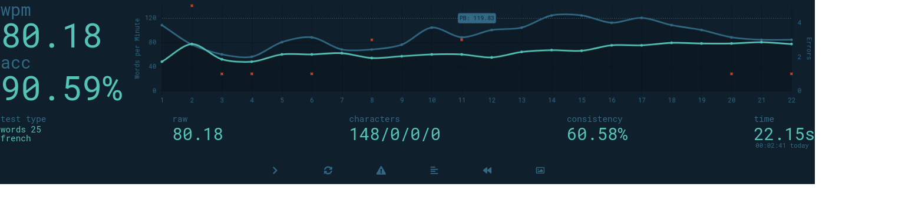
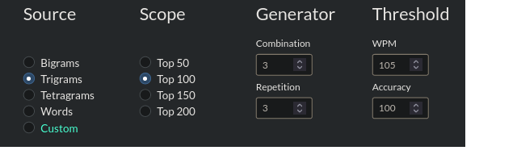
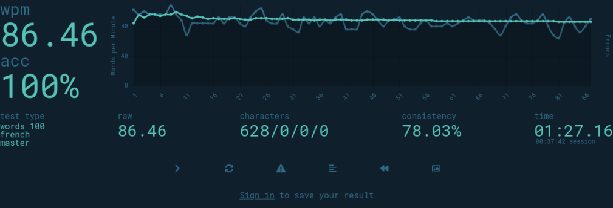

+++
title = "Apprendre une disposition de clavier"
date = 2024-07-02T08:01:23+01:00
author = "nuclear_squid"
tags = ["communauté", "tutoriel"]
+++

Apprendre une nouvelle disposition de clavier est un investissement de temps
important, qui implique généralement une perte de productivité durant cette
période. Heureusement, il existe de nombreux sites ou techniques que l’on peut
utiliser pour réduire le plus possible ce temps d’apprentissage !

Après avoir
changé *neuf fois* de disposition de clavier en 3,5 ans (Colemak, puis 8 versions
majeures d’Ergo‑L), j’ai compilé dans cet article toutes les techniques que j’ai
accumulées au fil du temps pour apprendre un nouveau layout.

:::{.highlight style="max-width: 32em;"}
- [Des conseils universels]
- [Les premiers pas]
- [Taper comme un singe]
- [Vers l’infini et au‑delà !]
- [Conclusion (TL;DR:)]
:::

Des conseils universels
--------------------------------------------------------------------------------

Avant de voir comment apprendre une nouvelle disposition de clavier, j’aimerais
donner quelques conseils pour progresser et qui sont applicables quelle que soit
la dispo :

### Être léger sur les touches

Ça ne sert à rien d’appuyer fort sur les touches, en utilisant juste la quantité
d’effort pour actionner les touches vous utiliserez beaucoup moins d’énergie et
ça vous laisse plus de marge pour taper vite par moments. Si vous avez un
clavier mécanique, un bon exercice est d’essayer d’actionner les touches sans
appuyer à fond (éviter le « bottom out »)

### Garder un rythme semi-constant

Ça aide à développer la mémoire musculaire, et évite de trop rapprocher les
frappes entre elles, ce qui peut causer des erreurs de timing.

### Utiliser [Ctrl]{.kbd}+[Backspace]{.kbd} pour effacer un mot complet en cas d’erreur

Non seulement ça évite de se tromper dans le nombre de caractères à effacer pour
arriver à l’erreur (ou pire, utiliser la *souris*), mais ça vous permet de
réessayer d’écrire le mot entièrement et de l’apprendre correctement. C’est aussi
souvent beaucoup plus efficace que [Backspace]{.kbd} seul, vu qu’on efface des
mots complets – et à haute vitesse, on voit souvent les erreurs tard.

### Surtout : soigner la précision !

Bouger les doigts vite c’est rigolo, mais si on fait pleins d’erreurs ça ne sert à
rien. On va souvent plus vite en ralentissant les doigts et faisant moins
d’erreurs qu’en bourrinant comme un malade mais en faisant une faute par mot.

Les premiers pas
--------------------------------------------------------------------------------

Ça y est c’est le grand jour, vous avez décidé d’apprendre une disposition
ergonomique. Vous avez installé le pilote, déplacé les touches ou mis des jolis
autocollants sur votre clavier pour avoir les nouvelles lettres au bon endroit
et vous êtes prêt à vous lancer !

Déjà ça commence mal. Le clavier est magnifique (j’en suis presque jaloux),
mais en faisant ça vous allez regarder votre clavier en cas de doute. Ça aide
grandement au début, mais ça vous empêche d’apprendre la dispo à l’aveugle –
une condition nécessaire pour taper de façon efficace et confortable au
clavier.

Si vous avez besoin d’une aide visuelle, on a un [cavalier][] que vous pouvez
imprimer et poser sur votre bureau.

### Une approche plus saine

Apprendre directement toute une disposition à l’aveugle est très compliqué,
c’est pour ça qu’il existe des sites qui vous font travailler seulement qu’une
petite partie des lettres disponibles. Il y en a deux que j’aime beaucoup :

- [Duck Typist][] (= la page « dactylo » d’Ergo‑L) : pas besoin d’installer la
  disposition, la page va l’émuler. Très strict sur la précision, mais très
  laxe sur la vitesse de frappe.
   <small> (Note : sous Windows, le pilote AHK cause des problèmes avec l’émulation.) </small>
- [Keybr][] : un site bien mieux fini que Duck Typist, mais qui se
  concentre sur la vitesse de frappe plus que sur la précision.
   <small> (Note : keybr ne sait pas émuler Ergo‑L.) </small>

Les deux sites fonctionnent de façon similaire : on commence par taper des mots
avec quelques lettres, et on rajoute des lettres possibles quand on commence à
gagner en confiance. Travailler les « n‑grammes » (enchaînements de `n` lettres)
est parfois recommandé à ce stade, mais de mon expérience ils ne sont pas assez
variés pour apprendre une disposition efficacement : on apprend les quelques
enchaînements demandés plutôt que le layout.

Pour les premiers pas avec une nouvelle disposition, vous pouvez rester dans
votre disposition d’origine au quotidien et vous entraîner périodiquement sur
le site que vous préférez dans la liste ci-dessus. Il vaut mieux s’entraîner
20–30 minutes par jour pendant une semaine que passer 4h sur le site d’un coup.
Le deuxième va être épuisant et vous risquez de vite oublier votre
entraînement (un peu comme étudier la veille d’un examen).

De mon expérience, il y n’a pas besoin d’apprendre l’entièreté du layout sur
ces sites-là (les 12 lettres les plus fréquentes suffisent, le reste peut
s’apprendre sur le tas), mais certain·e·s restent jusqu’au bout, souvent pour
le challenge, pour travailler la précision ou juste pour gagner
en confiance. En général, on passe une semaine ou deux à s’entraîner comme ça.

À ce stade, le plus important est d’apprendre la dispo avec les *doigts*, pas
avec la *tête* : si vous devez réfléchir à chacune des touches que vous
actionnez, vous ne pourrez jamais gagner en vitesse (en plus de vous épuiser
mentalement). Ça veut dire essayer de se passer de toute aide visuelle (si
possible), et chercher à développer une *mémoire musculaire précise* — la
vitesse viendra plus tard.

Taper comme un singe
--------------------------------------------------------------------------------

Une fois que vous avez les bases de la nouvelle dispo dans les doigts, je vous
recommande d’allez vous entraîner sur un autre site : [Monkeytype][]. Il
permet de s’entraîner sur de nombreux types d’exercices différents,
donne des jolies stats à la fin des exercices, et est *extrêmement
personnalisable* – tant pour l’apparence du site que pour les exercices eux-mêmes.

Le type d’exercice en lui-même n’est généralement pas très important, choisissez
celui que vous préférez. Comme pour la section précédente, il vaut mieux faire
des séances d’entraînements courtes régulièrement que de blinder une journée
avec ça.

Personnellement je prefère le mode *« words »*, qui génère un nombre donné de
mots aléatoirement. Vous pouvez choisir le nombre de mots, mais aussi le corpus
utilisé (dans la section *« language »* des paramètres) : le corpus par défaut
pour le français est assez réduit, sympa pour quand on débute ou pour tenter un
nouveau record, mais *« French 1k »* est plus intéressant. Vous pouvez aussi
activer les nombres et la ponctuations indépendamment du corpus. Dans le cas du
mode *« words »* ça donne des exercices vraiment pas réalistes, mais c’est bien
de les travailler de temps en temps.

(Note : Monkeytype a des corpus de code pour plein de langages différents,
très pratique pour bosser les mot-clés courants et les enchaînements de
symboles avec [AltGr]{.kbd})

### *« Gotta go fast ! »*

Ci-dessous, je vous ai mis un de mes exercices où j’ai tapé très vite. Ça m’a
demandé beaucoup d’effort mais quand même, 80 mots par minute c’est vraiment
rapide ! C’est cool non ?

Non, c’est **à chier**. Le score en mots par minute à beau être élevé, la
précision est **très** basse : 90.5 % ça peut paraitre beaucoup, mais ça implique
qu’un dixième des frapes au clavier étaient éronnées. Ces 10 % d’erreurs m’ont
coûté beaucoup plus que 10 % de vitesse, parce que j’ai dû retourner en arrière
pour les corriger. On peut d’ailleurs voir sur le graphique que la vitesse
brute (ligne bleu foncé) chute fortement autour des erreurs (croix rouges).

La vitesse de frappe va venir naturellement avec le temps, mais la précision
non. C’est important de s’entraîner à taper sans faire d’erreur. C’est pour ça
que je pense qu’en dessous de 97 % de précision vous pouvez considérer le test
comme un échec. (Il existe une option dans Monkeytype qui permet d’échouer le
test automatiquement quand la précision tombe sous un certain seuil, si vous le
souhaitez.)

En bougeant les doigts *moins vite*, mais en évitant les erreurs et en
cherchant à avoir un rythme relativement régulier, vous vous trouverez à taper
aussi vite (voire beaucoup plus !) en faisant une fraction de l’effort. C’est ce
qui m’est arrivé dans le test ci-dessous (tapé quelques minutes après celui
rempli d’erreurs).

À ce stade de l’entraînement, je vous conseille toujours de n’utiliser la nouvelle
disposition que pour les entraînements, et de ne changer de disposition qu’une
fois que vous avez pris en confiance. 35–40 mots par minute est en général une
vitesse amplement suffisante pour le monde réel, mais certain·e·s font le
changement plus tôt : on oublie vite sa disposition précédente et ça peut être
moins frustrant de taper lentement dans le nouveau layout que de faire des
erreurs avec l’ancien.

Vers l’infini et au‑delà !
--------------------------------------------------------------------------------

Ça y est c’est le grand jour, vous avez décidé d’utiliser votre nouvelle
disposition à temps plein. Vous vous sentez à l’aise, vous tapez suffisamment
vite, vous avez même quelques jolis screenshots de stats Monkeytype. Bien
joué ! Vous avez passé le plus dur dans l’entraînement, mais c’est à partir de
là que les exercices deviennent vraiment marrants. Dans cette section, je vais
vous montrer quelques entraînements que j’aime beaucoup pour passer vite au
niveau supérieur.

### Travailler les n‑grammes

> — Attends, mais tu disais pas que c’était nul pour apprendre une dispo ? 
> — Ouais, mais tu l’as apprise la dispo, et maintenant que tu as une mémoire
musculaire *précise*, travailler les n‑grammes peut aider à la rendre *efficace*.

[Ngram Type][] et [Ngram Type fr][] sont des très bons sites pour progresser en
vitesse. Personnellement, je m’entraîne généralement avec les paramètres
ci-dessous (mais n’hésitez pas à adapter la vitesse à vos besoins !), j’essaye de
viser 20 wpm au dessus de ce que je tape naturellement pour les trigrammes, et
40 wpm au dessus pour les digrammes.

Fun fact : la variante francophone de Ngram Type est maintenue par l’Ergonaute
@[Martin][], merci à lui !

### Mort subite !

Monkeytype a *beaucoup* d’options pour rajouter des challenges (souvent pas
très sérieux, comme la plupart des options de la *« fun box »*), mais mon option
préférée est de *très loin* la difficulté « master ». C’est très simple :
l’exercice est échoué à la moindre erreur !

C’est une façon redoutablement efficace de travailler la précision parce que ça
va vous forcer à trouver une façon de taper sans erreur pendant *longtemps*.
Une fois que vous avez pigé le changement de mentalité et que vous appliquez ça
au quotidien, vous allez faire beaucoup moins d’erreurs.

C’est aussi un challenge assez fun : essayer de taper le plus de mots possible
sans faire d’erreur. Mon record c’est 100 mots !

### « Je suis 4 univers parallèles en avance sur toi »

Une autre option de Monkeytype que j’aime beaucoup c’est *« read ahead »*, qui
cache les deux prochains mots qu’on s’apprête à taper. C’est extrêmement
déroutant au début, mais le truc qu’il faut comprendre c’est que ça n’est *pas*
un test de mémoire. Il faut continuer à taper de façon fluide, mais au lieu de
taper le mot qu’on est en train de lire, on tape le mot pendant qu’on lit le
mot `n+2`.

Une fois que la gymnastique mentale commence à rentrer, on élimine toutes les
pauses entre deux mots (vu que de base on a tendance à lire le mot, se préparer
à le taper, le taper très vite, lire le prochain mot…) en exécutant toutes ces
tâches en parallèle. Non seulement on tape plus vite, mais ça demande beaucoup
moins d’effort pour retranscrire nos pensées !

Il y a aussi les variantes *« easy »* et *« hard »* qui cachent 1 et 3 mots
respectivement.

Conclusion (TL;DR:)
--------------------------------------------------------------------------------

Vous connaissez donc maintenant ma méthode pour apprendre un nouveau layout.
Pour résumer :

1. on commence par apprendre les bases avec [Duck Typist][] ou [Keybr][] ;
2. on s’entraîne sur [Monkeytype][] quand on prend de l’aisance ;
3. on passe à temps plein sur la nouvelle dispo quand on se sent en confiance ;
4. on rajoute des challenges plus compliqués :
   - des entraînements de vitesse sur les n‑grammes avec [Ngram Type][] et [Ngram Type fr][] ;
   - des entraînements de précision avec le mode *« master »* de Monkeytype ;
   - des entraînements « taper sans réfléchir » avec *« read ahead »* de Monkeytype.

Et pour toutes les dispositions, une bonne technique de frappe implique :

- d’être léger sur les touches ;
- de garder un rythme semi-constant ;
- de privilégier [Ctrl]{.kbd}+[Backspace]{.kbd} pour corriger les fautes ;
- de ralentir un peu pour éviter les fautes.

[cavalier]:      https://ergol.org/installation/cavalier.pdf
[Keybr]:         https://www.keybr.com/
[Duck Typist]:   https://ergol.org/dactylo/
[Monkeytype]:    https://monkeytype.com/
[Ngram Type]:    https://ranelpadon.github.io/ngram-type/
[Ngram Type fr]: https://mart-e.github.io/ngram-type-fr/
[Martin]:       https://mart-e.be/
