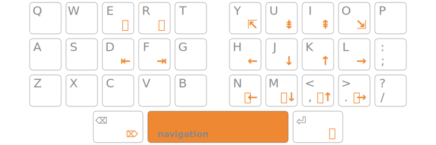

+++
title = "Vim pour les Ergonautes"
date = 2024-08-04T12:16:42+01:00
author = "kaze"
tags = ["communauté", "vim"]
+++

<style>
  /* blockquote { border-left: 2px solid var(--fg-accent); padding-left: 1em; } */
  blockquote { background-color: var(--bg-accent); margin: 0; padding: .5em 2em .5em 3em; position: relative; }
  blockquote::before { content: "»"; font-size: 2em; position: absolute; top: 0.7em; left: 0.5em; }
  cite { display: block; text-align: right; text-wrap: balance; font-style: normal; }
</style>

J’anime des [ateliers récurrents sur Vim][tupperVim] depuis une douzaine
d’années. Je suis également l’auteur de [Qwerty-Lafayette][] et un contributeur
actif d’Ergo‑L depuis deux ou trois ans.

Cet article fait suite à une conférence sur l’[ergonomie vimiste][] que j’ai
faite récemment aux [JdLL][]. Je trouve que, pour un usage technique, utiliser
Vim (ou Neovim, Kakoune, Helix, Doom-Emacs…) apporte une ergonomie très
supérieure à ce que n’importe quelle disposition de clavier peut offrir : on
écrit peu, et beaucoup de ce qu’on écrit est autocomplété.

<!--  -->

Depuis 6 semaines je fais le test d’écrire en Ergo‑L au quotidien. Comment cela
affecte-t-il ma productivité avec Vim ? Quelles sont les adaptations à faire
pour Ergo‑L ? Y a-t-il une vie après HJKL ?

<i lang="en">TL;DR</i> : Vim fonctionne parfaitement en Ergo‑L, il suffit de ne
**PAS** remapper HJKL.

<!--more-->

Pourquoi HJKL ?
--------------------------------------------------------------------------------

### Historique

L’emplacement des touches <kbd>h</kbd><kbd>j</kbd><kbd>k</kbd><kbd>l</kbd> est
un hasard : comme <kbd>Ctrl</kbd>-<kbd>h</kbd> et <kbd>Ctrl</kbd>-<kbd>j</kbd>
font Backspace et Line Feed (standard ASCII), donc gauche et bas,
l’[ADM-3A](https://en.wikipedia.org/wiki/ADM-3A#Legacy) sur lequel a été codé Vi
a élégamment complété avec <kbd>Ctrl</kbd>-<kbd>k</kbd> et
<kbd>Ctrl</kbd>-<kbd>l</kbd> pour haut et droite.


Ces touches étant très proches de la position de repos en Qwerty, surtout
<kbd>j</kbd><kbd>k</kbd> qui tombent sous les deux doigts forts de la main
droite, l’usage est resté. Et, clairement, la possibilité de toujours rester en
position dactylo fait partie des gros gains de confort que l’on découvre avec
Vim.

### Ne *PAS* remapper HJKL !

À une époque fort, fort lointaine, où j’aimais déjà Vim mais contribuais
beaucoup au projet Bépo, j’avais donc proposé de remapper les touches
<kbd>c</kbd><kbd>t</kbd><kbd>s</kbd><kbd>r</kbd> pour retrouver ce confort. [Ce
mapping](https://bepo.fr/wiki/Fichier:Vim-bepo-066.png) est toujours très
utilisé par les Bépoètes aujourd’hui.

Et c’était une erreur de débutant :

- ça a singulièrement limité mon apprentissage de Vim, car chaque enchainement
  de commandes devait être « traduit » dans ce nouveau référentiel ;
- surtout, ça m’a maintenu dans des déplacements « case à case », alors que
  Vim sait faire **beaucoup** mieux que ça.

La [suite](#la-vie-après-hjkl) de ce billet détaille comment mieux se déplacer
dans Vim.

### Mieux que HJKL : une couche de navigation

Se limiter aux flèches ou à HJKL est très sous-optimal dans Vim, mais on peut
souhaiter avoir ce confort d’un pavé de flèches sous la position de repos — et
ce, dans toutes les applications, pas seulement dans Vim.

Pour cela on définit un <i lang="en">layer</i>, que l’on implémente via QMK ou
ZMK si on utilise un clavier programmable, ou avec [Kanata][] si on est sur un
clavier de laptop.

C’est ce que l’on propose avec [Arsenik][], qui donne une couche [NavNum][] avec
un appui long sur la barre d’espace :


Personnellement j’ai opté pour un layer de navigation plus vimiste, avec les
flèches en <kbd>h</kbd><kbd>j</kbd><kbd>k</kbd><kbd>l</kbd> et <kbd>Esc</kbd>
en accès direct sous un pouce :



Plutôt que de configurer *n* applications pour remapper HJKL avec un résultat
souvent imparfait, on utilise donc un layer dédié. Même sans clavier
programmable, une seule configuration Kanata est plus simple à maintenir que *n* 
configurations d’applications.


La vie après HJKL
--------------------------------------------------------------------------------

<blockquote>
Après une semaine de test y a pas photo : ne pas utiliser [h]{.kbd} et
[l]{.kbd} c'est le pied !

Le fait de ne pas remapper les touches par défaut en Ergo‑L est **LE**
<i lang="en">game changer</i> : ça facilite énormément l’apprentissage sans
avoir à se dire « ah mais ce truc, ça se fait comment avec mes mappings ? ».

J’ai plus progressé en Vim en quelques jours grâce à ça qu’en quelques années
avec mes mappings Bépo hasardeux.

<cite>— [Vincent Jousse](vjousse), auteur de [*Vim pour les humains*][vimebook]</cite>
</blockquote>

### Déplacements verticaux

Avouons-le de suite : se passer de <kbd>j</kbd><kbd>k</kbd> n’est pas immédiat.
C’est la raison pour laquelle Ergo‑L, comme toutes les dispositions qui
utilisent la couche de symboles Lafayette, a `+` et `-` en AltGr sur ces deux
touches. L’action de `+` et `-` étant très proche de `j` et `k`, c’est
utilisable sans aucun mapping : on a le même confort qu’en Qwerty ou Azerty pour
ces deux actions, il suffit de presser <kbd>AltGr</kbd>.

Mais il ne faut pas se contenter de ces deux touches pour les déplacements
verticaux. Vim propose notamment :

- `{` et `}` pour sauter à la ligne vide précédente ou suivante ;
- `/` et `?` pour rechercher une expression vers le bas ou le haut ;
- `*` et `#` pour aller à la prochaine ou précédente occurrence du mot sous le
  curseur ;
- `gg` et `G` pour sauter en début ou fin de document.

La couche AltGr a été optimisée pour Vim, et la position de `{` et `}` en est
une conséquence.

### Déplacements horizontaux simples

La première étape consiste à naviguer mot à mot plutôt que case à case : plus
rapide, plus précis. On a ainsi :

- `w` et `b` pour aller au mot suivant (`w`ord) ou précédent (`b`ackwards) ;
- `e` et `ge` pour aller à la fin (`e`nd) du mot suivant ou précédent ;
- `^` et `$` pour aller en début ou fin de ligne (ces caractères sont en
  <kbd>AltGr</kbd> + main gauche).

Et on ne cherchera pas à corriger un mot lettre à lettre. Au contraire, on
réécrira systématiquement le mot en entier :

- soit c’est du texte, et c’est souvent plus rapide que de viser la bonne lettre
  puis de corriger (et on en profite pour apprendre à le taper proprement au
  passage — ça fait progresser très vite en dactylographie) ;
- soit c’est du code, et c’est **toujours** plus rapide de le retaper du début
  en profitant de l’autocomplétion.

On utilisera donc :

- `cw` quand on est en début de mot (`c`hange `w`ord) ;
- `cb` quand on est en fin de mot (`c`hange `b`ackwards) ;
- ou `ciw` quelle que soit la position dans le mot (`c`hange `i`n `w`ord).

Ce dernier `ciw` utilise ce qu’on appelle un <i lang="en">text object</i>.
Maitriser ce genre d’opérations permet de s’économiser encore des actions dans
Vim.

### Déplacements horizontaux avancés

Les commandes `f` `F` `t` `T` fournissent une façon plus rapide de se déplacer
horizontalement :

- `f`x (`f`ind x) déplace le curseur sur la prochaine lettre x ;
- `t`x (`t`ill x) déplace le curseur sur la position précédant la prochaine
  lettre x ;
- `F` et `T` (majuscules) font la même chose, mais dans l’autre sens (= vers le
  début de ligne) ;
- `;` et `,` vont à la prochaine ou précédente occurrence.

J’utilise ces mouvements pour aller plus vite à un mot donné qu’avec une
succession de `w` ou `b`. C’est particulièrement efficace quand on vise un
caractère spécial (cas fréquent pour du code), mais ça reste rapide en ciblant
une lettre… ou même tout simplement l’espace.

On peut aussi utiliser ces mouvements pour cibler une lettre spécifique à
corriger dans un mot. Je préfère corriger par mots entiers avec `ciw` (voir plus
haut), mais ça peut être pratique. Par exemple, pour corriger la phrase suivante
alors que le curseur est en fin de ligne :

```
J’aime taper dans Vmi sans faire de fautes.
```

… il suffit de faire `TVxp`.

De base, ces déplacements sont limités à la ligne courante. Des greffons comme
[clever-f][] ou [Fanf,ingTastic;][FfTt]  étendent ce comportement au document
entier tout en proposant des améliorations ergonomiques, et en conservant la
logique `f` `F` `t` `T`.

### Déplacements façon « EasyMotion »

[EasyMotion][] (Vim), [leap.nvim][] ou [flash.nvim][] (Neovim) utilisent une
logique proche de `f` `F` `t` `T` mais en utilisant **deux** caractères cibles
au lieu d’un seul. Cela permet de se déplacer très rapidement dans tout le
document, en profitant d’une aide visuelle.

On se rapproche alors du comportement de [Vimium][]. Ces greffons peuvent
faciliter grandement les déplacements dans Vim ou Neovim pour les débutant·e·s,
et les utilisateurices avancé·e·s gagneront encore en efficacité.

### ~/.vimrc

Bien que Vim fonctionne <i lang="en">out of the box</i> avec Ergo‑L, j’utilise
cinq mappings pour me faciliter la tâche :

- `gj` et `gk` sur `+` et `-` pour avoir exactement le même comportement
  (= préserver la colonne courante) ;
- interversion de `,` et `;` pour que l’action sans <kbd>Shift</kbd> aille vers
  la suite (recommandé pour toutes les dispositions où `;` est en
  <kbd>Shift</kbd> : Qwertz, Lafayette, Bépo…) ;
- <kbd>Ctrl</kbd><kbd>i</kbd> sur <kbd>Ctrl</kbd><kbd>c</kbd> pour avoir une
  paire pour la navigation dans la [pile de
  sauts](https://vimhelp.org/motion.txt.html#jump-motions).

```vim
nnoremap + gj
nnoremap - gk
nnoremap , ;
nnoremap ; ,
nnoremap <C-c> <C-i>
```

C’est l’occasion de mentionner d’autres mappings sans rapport avec Ergo‑L mais
que je recommande vivement quelle que soit la disposition de clavier utilisée :

- `y$` sur `Y`, par cohérence avec `C` et `D` ;
- « undo » sur `U`, pour s’éviter `<C-r>` et redéfinir le `U` natif de Vim qui
  est source de confusion ;
- `q:` (historique de commandes) sur `Q`, qui est lui aussi source de confusion
  (= mode `Ex`) ;
- `<leader>` sur <kbd>Espace</kbd>. Indispensable ! :-)

```vim
nnoremap Y y$
nnoremap U <C-r>
nnoremap Q q:
nnoremap <Space> <Nop>
let mapleader=" "
```

Pour aller plus loin
--------------------------------------------------------------------------------

### Navigation

Je considère que les panneaux latéraux avec une arborescence de fichiers sont un
<i lang="en">anti-pattern</i>. Vim propose des fonctions de plus haut niveau
bien plus efficaces pour naviguer entre plusieurs fichiers, notamment :

- les <i lang="en">fuzzy finders</i> tels que [fzf][] et [Telescope][] ;
- les serveurs [LSP][], pour se déplacer dans un arbre de code.

Ce sont deux domaines où Neovim est sensiblement supérieur à Vim. Telescope est
vraiment magique. <3

### Vimification du bureau

On peut profiter de l’ergonomie vimiste sur l’ensemble du bureau. Parmi les
outils dont j’aurais du mal à me passer, il y a :

- [Vimium][] (ou [Tridactyl][]) pour naviguer au clavier dans Firefox ou Chrome ;
- [i3][] ou [Sway][] comme gestionnaires de fenêtres sous Linux ⁽¹⁾ ;
- [dmenu][] ou [Rofi][] pour lancer une app via fuzzy-matching ;
- [Ranger][], [lf][], [Yazi][] comme explorateurs de fichiers dans le terminal —
  voire dans Vim, avec l’extension [TermOpen][].

Avec ces outils, je n’ai plus l’usage de la souris : je fais quasiment tout au
clavier, et l’émulation QMK de mon Ferris suffit pour les rares cas où je dois
déplacer le pointeur.

⁽¹⁾ Sous Windows, [Komorebi][] serait une alternative à tester.


Conclusion
--------------------------------------------------------------------------------

Adepte du Qwerty (version Lafayette) depuis plus de 15 ans, je craignais de
perdre en confort sous Vim avec Ergo‑L. À l’usage, le seul inconvénient que je
vois c’est de devoir maintenir <kbd>AltGr</kbd> pour les déplacements verticaux
`j`/`k` — mais ça s’enchaine très bien avec `{`/`}` et `^`/`$` en main gauche,
donc le niveau de confort reste similaire.

Adepte du déplacement mot à mot, je pensais ne pas utiliser `h`/`l` du tout mais
le passage à Ergo‑L m’a prouvé le contraire : je les utilisais souvent pour un
seul caractère. <kbd>F</kbd> et <kbd>T</kbd> étant bien placés en Ergo‑L, je les
utilise désormais beaucoup plus et ça m’évite des successions d’appuis sur
<kbd>W</kbd> et <kbd>B</kbd>.

Pour le reste, je n’ai pas ressenti de frictions sous Vim en passant à Ergo‑L.
Il y a même des gains inattendus, comme avoir <kbd>N</kbd> en position de repos
et le point sur l’autre main.

**Ergo‑L a été conçu par des Vimistes, et ça change tout !**

J’en profite pour remercier [Lobre][], Lafayettiste et Ergonaute de la toute
première heure, utilisateur avancé de Vim et Kakoune, à qui l’on doit
l’essentiel de cette couche AltGr — et en particulier son adaptation pour Vim.


[Arsenik]:    /claviers/arsenik
[NavNum]:     /claviers/compacts/#layer-navnum

[JdLL]:       https://jdll.org
[vjousse]:    https://mastodon.social/@vjousse@mamot.fr/112886863404314065
[Kanata]:     https://github.com/jtroo/kanata
[vimebook]:   https://vimebook.com/fr
[tupperVim]:  https://tuppervim.org
[clever-f]:   https://github.com/rhysd/clever-f.vim
[FfTt]:       https://github.com/dahu/vim-fanfingtastic
[EasyMotion]: https://github.com/easymotion/vim-easymotion
[flash.nvim]: https://github.com/folke/flash.nvim
[leap.nvim]:  https://github.com/ggandor/leap.nvim

[Vimium]:     https://vimium.github.io/
[Tridactyl]:  https://github.com/tridactyl/tridactyl
[Telescope]:  https://github.com/nvim-telescope/telescope.nvim
[fzf]:        https://github.com/junegunn/fzf.vim
[LSP]:        https://microsoft.github.io/language-server-protocol/
[i3]:         https://i3wm.org/
[Sway]:       https://swaywm.org/
[Komorebi]:   https://lgug2z.github.io/komorebi/
[dmenu]:      https://tools.suckless.org/dmenu/
[rofi]:       https://github.com/davatorium/rofi
[ranger]:     https://github.com/ranger/ranger
[lf]:         https://github.com/gokcehan/lf
[yazi]:       https://github.com/sxyazi/yazi
[TermOpen]:   https://github.com/fabi1cazenave/termopen.vim
[Lobre]:      https://github.com/lobre

[Qwerty-Lafayette]:   https://qwerty-lafayette.org
[ergonomie vimiste]:  https://fabi1cazenave.github.io/slides/2024-jdll-vim-ergo/
