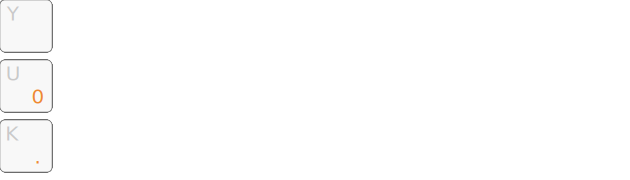
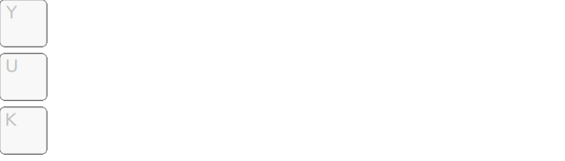

+++
title = "Claviers compacts"
+++

Une approche moderne et efficace : faire bouger les touches sous les doigts,
plutôt que déplacer les doigts. Le gain de confort est **très** significatif.

<!--more-->

<table class="highlight toc">
  <colgroup>
    <col width="34%" />
    <col width="33%" />
    <col width="33%" />
  </colgroup>
  <tr>
    <td> [][4×6] </td>
    <td> [][3×6] </td>
    <td> [][3×5] </td>
  </tr>
  <tr>
    <td> [4×6][] </td>
    <td> [3×6][] </td>
    <td> [3×5][] </td>
  </tr>
  <tr>
    <td> facilité et polyvalence </td>
    <td> le 1DFH par essence </td>
    <td> la <i lang="en">red pill</i> </td>
  </tr>
</table>

Layer « NavNum »
-------------------------------------------------------------------------------

Avec Ergo‑L, comme le pavé principal de 3×10 touches permet de saisir toutes les
lettres (en direct) et tous les symboles (via [AltGr]{.kbd}), on n’a besoin que
d’un seul layer pour disposer de toutes les touches manquantes : les touches
de déplacement et le pavé numérique.

Pour celles et ceux qui utilisent les touches de fonction, un demi-layer peut
être dédié :

[4×6]{id="kbd_4x6"} : facilité et polyvalence
--------------------------------------------------------------------------------

### Géométrie

C’est le format de clavier le plus courant, et pour cause !

- Chiffres en direct : facile pour débuter, indispensable pour les jeux ;
- 6 colonnes par main : [Entrée]{.kbd} [Backspace]{.kbd} [Delete]{.kbd} sont au
  même endroit que sur un clavier standard, mais plus proches.

![[Sofle][], 58 touches (4×6+5)](4x6_ergol.svg)

En Ergo‑L c’est le clavier ergonomique qui est le plus facile à prendre en main
— bien plus simple que les claviers ergonomiques [full-size][], et plus adapté à
[l’apprentissage de la dactylographie][dactylo] que les claviers standard.

### Modèles courants

Outre le [Sofle][], le [Lily58][] et l’Iris56 sont très populaires en split.

Certains modèles ont des touches centrales supplémentaires : c’est le cas du
Lily58 qui a une touche supplémentaire par demi-clavier (4×6+4+1), ainsi que des
[KeyboardIO][Model100] (4×6+5+3) et [Dygma Defy][Defy] (4×6+8+3) qui ont trois
touches supplémentaires à la façon d’un [ErgoDox][].

En monobloc, le [Preonic][] est simple et efficace. Parfait pour débuter.

**Attention** : cette géométrie de clavier a besoin d’*au moins* trois touches
par pouce. Les claviers 4×6+2 comme le ZSA Voyager reposent sur l’utilisation de
[homerow-mods][], qui ne sont pas du tout à la portée des débutant·e·s.

[3×6]{id="kbd_3x6"} : le [1DFH][] par essence
--------------------------------------------------------------------------------

Avec un peu d’habitude en [4×6][], on réalise que les chiffres sont plus
accessibles en [NavNum][] que sur la rangée du haut, qui devient superflue.

### Géométrie
 
![[Corne][], 42 touches (3×6+3)](3x6_ergol.svg)

Sans la rangée de chiffres, toutes les touches du clavier peuvent être activées
en maintenant n’importe quelle touche de pouce. On peut ainsi se contenter de
modifieurs asymétriques : trois touches par pouce suffisent.

Avec un tel format 42 touches, aucun doigt ni aucun pouce ne se déplace de plus
d’une touche de sa position de repos.

### Modèles courants

Si le [Corne][] est sans conteste le clavier 3×6 le plus populaire en split, le
[Planck][] est de loin le plus connu en monobloc. Ce sont ces deux claviers qui
ont lancé le mouvement des claviers compacts.

Nota : les [Sofle][] et [Preonic][] sont essentiellement des versions 4×6 des
Corne et Planck respectivement, créées pour les personnes souhaitant conserver
un accès direct aux chiffres.

[3×5]{id="kbd_3x5"} : la <i lang="en">« red pill »</i>
--------------------------------------------------------------------------------

Quand le [1DFH][] est devenu une évidence, la suite logique est de se
débarrasser de toutes les extensions latérales des auriculaires. Radical ! Le
gain de confort est tel qu’il est impossible de revenir en arrière.

### Géométrie

![[Ferris][], 34 touches (3×5+2) et beaucoup de *stagger*](3x5_ergol.svg)

Pour utiliser ces claviers, l’approche [Miryoku][] est la plus courante :
layer-taps sous les pouces et homerow-mods sous les doigts.

### Layer-taps

Chaque touche de pouce va assurer deux fonctions :

- émettre [Backspace]{.kbd}, [Esc]{.kbd}, [Entrée]{.kbd}, [Espace]{.kbd}
  quand elle est pressée et relâchée rapidement (*tap*) ;
- changer de layer quand elle est maintenue (*hold*).

(On considère que [Shift]{.kbd} et [AltGr]{.kbd} sont des layers au même titre
que [NavNum][] : contrairement à [Ctrl]{.kbd} ou [Alt]{.kbd}, leur rôle est bien
de modifier les caractères de base.)

Les détails de synchronisation sont importants. En particulier, la durée de
temporisation est sensible : 300 ms est une bonne valeur pour débuter, on pourra
la réduire doucement au fil de la progression.

<!--
Plus finement, on peut choisir parmi deux comportements :

- classique : la touche se comporte comme un *tap* tant qu’elle n’est pas
  maintenue au moins 300 ms ; on accepte donc un petit délai avant d’activer un
  layer, ce qui convient parfaitement à notre touche
  [Espace]{.kbd}/[NumNav]{.kbd}.
- « Space Cadet » ou « permissive hold » : il faut que la touche de pouce soit
  pressée et relâchée sans qu’aucune autre touche n’ait été activée pour
  produire le *tap*, sans quoi c’est le *hold* qui est retenu. C’est bien adapté
  à [Shift]{.kbd} et [AltGr]{.kbd}, pour lesquelles on ne veut pas de délai
  susceptible de ralentir la saisie ; et on en profite pour associer en *tap*
  des touches que l’on veut éviter d’actionner par erreur, comme [Entrée]{.kbd}
  ou [Esc]{.kbd}.
-->

### Homerow-mods

On utilise le même principe pour associer les modifieurs [Ctrl]{.kbd},
[Alt]{.kbd}, [Cmd]{.kbd} aux touches de repos des deux mains : [N]{.kbd}
[E]{.kbd} [S]{.kbd} pour la main gauche, [R]{.kbd} [T]{.kbd} [I]{.kbd} pour la
main droite.

On se fait assez rapidement aux layer-taps sous les pouces, mais les
homerow-mods sont plus longs à acquérir : on a tendance à ne pas lever les
doigts assez vite, ce qui risque de déclencher des modifieurs par erreur.

Certain·e·s ne s’y font jamais ; d’autres contournent le problème avec des
[combo-mods][] ou des [callum-mods][]. Mais le jeu en vaut vraiment la
chandelle : le gain de confort est phénoménal ! En étant patient et en utilisant
des temporisations assez longues au début (300 ms voire 400 ms), on finit par
s’y faire et ça devient une évidence.

Pour creuser le sujet, [ce billet][precondition] fait référence de nos jours.

### Modèles courants

En split, le [Ferris][] a de nombreux dérivés : [Sweep][], [Chocofi][]…

En monobloc, l’[Atreus][] est remarquable : simple, peu cher, il dispose de
suffisamment de touches (5 par pouce) pour pouvoir se passer de homerow-mods.
Certainement le 3×5 le plus simple à prendre en main.

Pour qui ?
--------------------------------------------------------------------------------

TL;DR; les [4×6][] conviendront toujours, quel que soit le layout utilisé, à
condition d’avoir *au moins* trois touches par pouce.

**Les Ergonautes peuvent utiliser tous ces claviers sans souci**, leur
disposition est faite pour ça !

- Les [4×6][] et [3×6][] sont envisageables pour débuter, et ne nécessitent
  aucune adaptation : une touche [AltGr]{.kbd} sous un pouce, un layer
  [NavNum][] et tout est calé.
- Les [3×5][] se destinent à une utilisation plus avancée, reposant sur les
  [layer-taps][lt] et [homerow-mods][hrm].

**En AZERTY**, les [4×6][] sont un choix raisonnable. Certains modèles (p. ex.
[Sofle][] v2 ou [Lily58][]) disposent de touches supplémentaires au centre pour
placer [Entrée]{.kbd} et [Backspace]{.kbd} sous les index, permettant ainsi de
laisser [Shift]{.kbd} inchangées sous les auriculaires, et seront plus
intuitifs.

**En Bépo**, les [4×6][] et [3×6][] sont envisageables. L’effort d’adaptation
est nettement plus significatif, y compris pour les variantes qui se proclament
conçues « pour tous les claviers, sans adaptation » :

- une couche de symboles doit être définie en plus de la couche [AltGr]{.kbd} ;
- pour déplacer le moins possible les lettres de la 7e colonne du
  clavier ISO ([W]{.kbd} et [Ç]{.kbd} et Bépo), il faut :
  - déplacer [Entrée]{.kbd} et [Backspace]{.kbd} ;
  - renoncer au [Shift]{.kbd} droit et lui trouver une place sous les pouces.

L’effort d’adaptation est donc (nettement) supérieur à celui que les Ergonautes
feraient pour un clavier 3×5, et aboutit à une utilisation qui sera très
différente entre un clavier standard et un clavier ergonomique. Il serait bien
plus rapide d’apprendre [Bépolar][]… voire Ergo‑L. ;-)

[4×6]:       #kbd_4x6
[3×6]:       #kbd_3x6
[3×5]:       #kbd_3x5
[NavNum]:    #layer-navnum
[lt]:        #layer-taps
[hrm]:       #homerow-mods
[full-size]: /claviers/full-size
[ErgoDox]:   /claviers/full-size/#géométrie-ergodox
[dactylo]:   /articles/apprendre_a_taper/
[Bépolar]:   /lafayette#bépolar
[1DFH]:      /presentation/#dfh-1u-distance-from-home

[Sofle]:     https://github.com/josefadamcik/SofleKeyboard
[Lily58]:    https://github.com/kata0510/Lily58
[Preonic]:   https://olkb.com/collections/preonic
[Model100]:  https://shop.keyboard.io/products/model-100
[Defy]:      https://dygma.com/pages/defy
[Corne]:     https://github.com/foostan/crkbd
[Planck]:    https://olkb.com/collections/planck
[Ferris]:    https://github.com/pierrechevalier83/ferris
[Sweep]:     https://github.com/davidphilipbarr/Sweep
[Chocofi]:   https://github.com/pashutk/chocofi
[Atreus]:    https://atreus.technomancy.us/

[Miryoku]:       https://github.com/manna-harbour/miryoku
[precondition]:  https://precondition.github.io/home-row-mods
[combo-mods]:    https://jasoncarloscox.com/writing/combo-mods/
[Callum-mods]:   https://github.com/qmk/qmk_firmware/blob/user-keymaps-still-present/users/callum/readme.md
