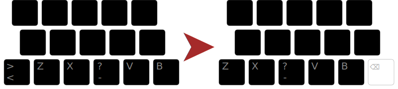

+++
title = "Installation"
aliases = ["lts"]

[params]
cssSheets = ["/css/keebs.css"]
jsModules = ["/js/x-keyboard.js"]
jsScripts = ["/js/keebs.js"]
footer = "propulsé par [x-keyboard](https://onedeadkey.github.io/x-keyboard)"
+++




Téléchargement
--------------------------------------------------------------------------------

### Pilotes nomades : [ergol_nomade.zip][]

Une archive ZIP contenant les pilotes ne nécessitant pas de droits
d’administration, qui peuvent fonctionner depuis une clé USB. (Pour tous les
systèmes.)

### Windows : [ergol_kbd.exe][]

Exécuter l’installeur et relancer la session. La disposition de clavier
apparaît dans la barre de langues (indicateur de la barre des tâches).

### macOS : [ergol.keylayout][]

Enregistrer dans `/Library/Keyboard Layouts` et relancer la session.
La disposition de clavier est disponible dans les préférences sous
« Clavier », puis « Méthodes de saisie ».
On peut aussi l’enregistrer dans `~/Library/Keyboard Layouts`
(pour le seul utilisateur courant), mais la disposition ne sera pas
active au login.

Il est possible (et recommandé) d’utiliser [Karabiner][]
pour [inverser les touches](karabiner_settings.png) [⌘ Command]{.kbd}
et [⌥ Option]{.kbd} à droite, afin d’accéder plus facilement à la couche
de symboles.

### Linux : [ergol.xkb_symbols][]

Ergo‑L est déjà inclus dans toutes les distributions Linux dotées de `xkeyboard-config`
en [version 2.42 ou ultérieure](https://repology.org/project/xkeyboard-config/badges),
ce qui inclut notamment Arch, Debian Trixie/Sid, Fedora Rawhide, Gentoo, Manjaro
Testing/Unstable, OpenMandriva Rolling/Cooker, OpenSUSE Tumbleweed, Slackware
Current, Ubuntu 24.10.
<!-- Il a aussi été inclus dans Ubuntu 24.04 LTS (rétro-portage). -->

Pour les autres distributions, copier ce pilote dans `xkb/symbols/custom` :

```bash
sudo wget -O ${XKB_CONFIG_ROOT:-/usr/share/X11/xkb}/symbols/custom \
https://github.com/Nuclear-Squid/ergol/releases/download/ergol-v1.0.0/ergol.xkb_symbols
```

La disposition de clavier ainsi installée est disponible dans le gestionnaire de
préférences du bureau sous un nom générique (« custom layout », « disposition
personnalisée », etc.). Sous XOrg on peut aussi l’activer directement en ligne
de commande :

```bash
setxkbmap custom
```

D’autres méthodes d’installation sont possibles, en passant le [fichier
source][] à [XKalamine][].

### Aide-mémoire : [cavalier.pdf][]

Une aide pour apprendre la dispo. À imprimer, plier et placer sur son bureau !


Variante en A (« <i lang="en">angle-mod</i> »)
--------------------------------------------------------------------------------



Des pilotes incluant l’[angle-mod][] seront proposés. Il est d’ores et déjà
possible d’appliquer cet angle-mod et bien d’autres fonctionnalités via
[kanata][] et la configuration [Arsenik][].


Résolution de problèmes
--------------------------------------------------------------------------------

### Windows

Les touches mortes chainées ne sont pas reconnues par certaines applications,
notamment [Firefox][firefox-cdk] et [Wezterm][wezterm-cdk].

Comme [AltGr]{.kbd} est équivalent à [Ctrl]{.kbd}-[Alt]{.kbd} sous Windows, les
raccourcis clavier de certaines applications peuvent être déclenchés par
[AltGr]{.kbd}.

Avec GeForce Experience, [AltGr]{.kbd}-[M]{.kbd} (pour écrire `&`) peut être
capté par « Superposition en jeu » pour couper le micro.
Il suffit d’aller dans GeForce Experience sur la roue dentée > Généralités >
Superposition en jeu : Paramètres > Raccourcis claviers, pour changer ou
supprimer ce raccourci. Il est aussi possible de désactiver complètement la
Superposition en jeu.

De même avec Keepass 2, [AltGr]{.kbd}-[A]{.kbd} (pour écrire `{`) est capté même si
le programme n’est pas au premier plan. Pour cela, aller dans Tools > Options… >
onglet Integration > encart System-wide hot keys, et changer ou supprimer la
valeur du raccourci Global auto-type.

### Linux

Avec certains bureaux (Gnome notamment), la touche Typo [★]{.odk} ne fonctionne
que si Ergo‑L est défini comme disposition par défaut, c’est-à-dire en haut de
la liste dans les préférences clavier.

[Wezterm][] ajoute un `o` à chaque pression de la touche Typo [★]{.odk}. C’est une
[régression connue][wezterm-bug], [un patch est en cours][wezterm-patch].


Licence
--------------------------------------------------------------------------------

[WTFPL](http://wtfpl.net/) – Do What the Fuck You Want to Public License.


[fichier source]:    /layouts/ergol.toml
[cavalier.pdf]:      cavalier.pdf
[ergol_nomade.zip]:  https://github.com/Nuclear-Squid/ergol/releases/download/ergol-v1.0.0/ergol_nomade.zip
[ergol_kbd.exe]:     https://github.com/Nuclear-Squid/ergol/releases/download/ergol-v1.0.0/ergol_kbd.exe
[ergol.keylayout]:   https://github.com/Nuclear-Squid/ergol/releases/download/ergol-v1.0.0/ergol.keylayout
[ergol.xkb_symbols]: https://github.com/Nuclear-Squid/ergol/releases/download/ergol-v1.0.0/ergol.xkb_symbols
[XKalamine]:         https://github.com/OneDeadKey/kalamine#xkalamine
[Karabiner]:         https://karabiner-elements.pqrs.org

[Arsenik]:           /claviers/arsenik/
[kanata]:            https://github.com/jtroo/kanata
[angle-mod]:         https://colemakmods.github.io/ergonomic-mods/angle.html

[firefox-cdk]:       https://bugzilla.mozilla.org/show_bug.cgi?id=1910287
[wezterm]:           https://github.com/wez/wezterm/
[wezterm-cdk]:       https://github.com/wez/wezterm/issues/5866
[wezterm-bug]:       https://github.com/wez/wezterm/commit/b8d93edce6267b09d8926f13de9620ad1ae5ea1f
[wezterm-patch]:     https://github.com/wez/wezterm/pull/4991
